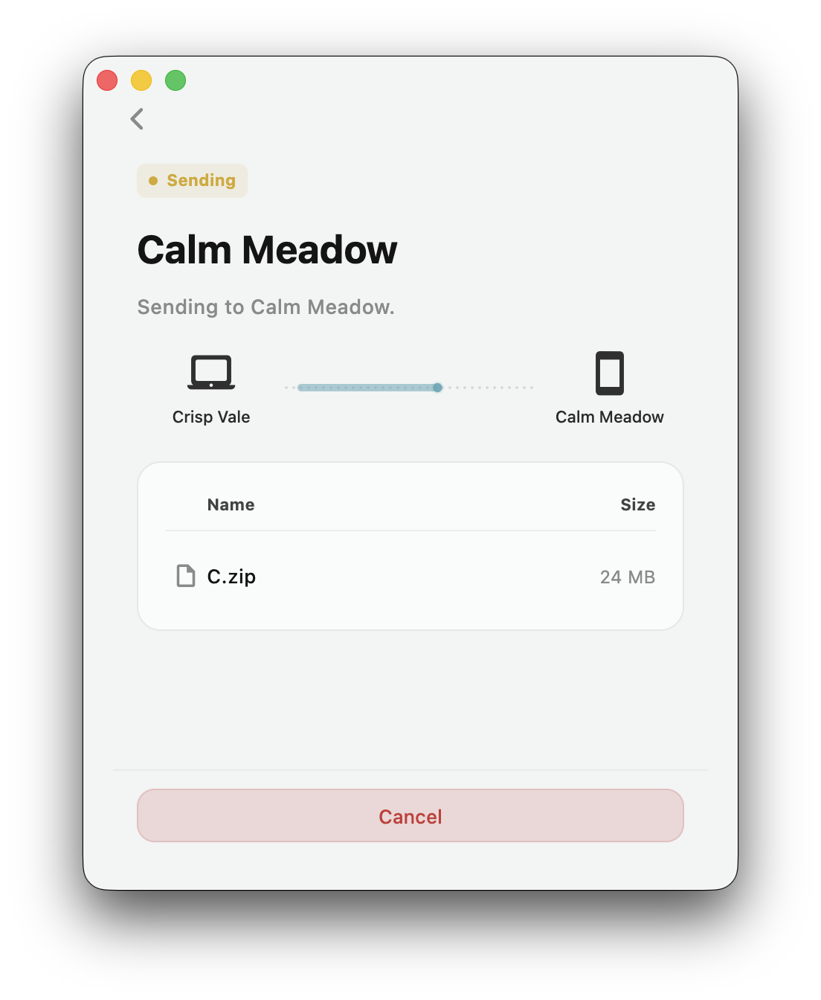

> [!WARNING]
> Drift is currently in **Beta**. While we strive for stability, you may encounter bugs. We appreciate your patience and feedback!

  

# 
Drift

<strong>Drift is your free, open-source alternative to AirDrop—built to work across every device you own.</strong>

  

## Features

- **Send files directly to anyone, anywhere in the world.** Pick your files, connect, and send directly to the other device, with no uploads and no extra steps.
- Use **Drift** across **macOS, Linux, Windows, Android, and iOS**.
- **End-to-end encrypted:** Only you and the recipient can read your files; no one else can.
- **Modern & Fast:** Written in Rust & Flutter and establishes direct QUIC connections between the devices.
- **Free & open source:** No ads, no limits on what you send, and no account required.

## Installation

| Platform | Download |
| --- | --- |
| macOS | [drift-macos-v0.3.1.dmg](https://github.com/vsamarth/drift/releases/download/v0.3.1/drift-macos-v0.3.1.dmg) |
| Windows | [drift-windows-setup-v0.3.1.exe](https://github.com/vsamarth/drift/releases/download/v0.3.1/drift-windows-setup-v0.3.1.exe) |
| Linux | [drift-linux-v0.3.1.deb](https://github.com/vsamarth/drift/releases/download/v0.3.1/drift-linux-v0.3.1.deb) |
| Android | [drift-android-v0.3.1.apk](https://github.com/vsamarth/drift/releases/download/v0.3.1/drift-android-v0.3.1.apk) |
| iOS | *Coming soon* |

> [!TIP]
> **macOS Gatekeeper:** If macOS blocks the app because it is currently unsigned, move it to your Applications folder and run:
> `xattr -rd com.apple.quarantine /Applications/Drift.app`

**From source:** Build the app in [`flutter/`](flutter/); see [`flutter/README.md`](flutter/README.md).

## Getting Started

Drift is simple by design. To get started, follow these quick steps:

1. Choose (or drop) the files you want to send.
2. Select the receiver from nearby devices or use the 6-character pairing code.
3. The receiver reviews and accepts to start the transfer.

## How It Works

- **Discovery:** Devices connect via a **discovery server** or **LAN discovery**. We only exchange the network info needed to find your peer—never your files.
- **Direct P2P:** We establish a direct, **[end-to-end encrypted](https://docs.iroh.computer/deployment/security-privacy)** connection between devices.
- **Explicit Consent:** No data moves until the receiver reviews the file manifest and accepts the transfer.

## Roadmap

Drift is still in its early stages. We are focused on stability and UX, and we will continue shipping essential features. Feel free to open a discussion with suggestions. Here are some ideas we are working on:

- Remember trusted devices as favorites for faster repeat transfers.
- Add resumable downloads/transfers for interrupted sessions.
- Keep Drift listening in the background so it is always ready to receive files.

## License

This project is licensed under the MIT License. See [`LICENSE`](LICENSE).
